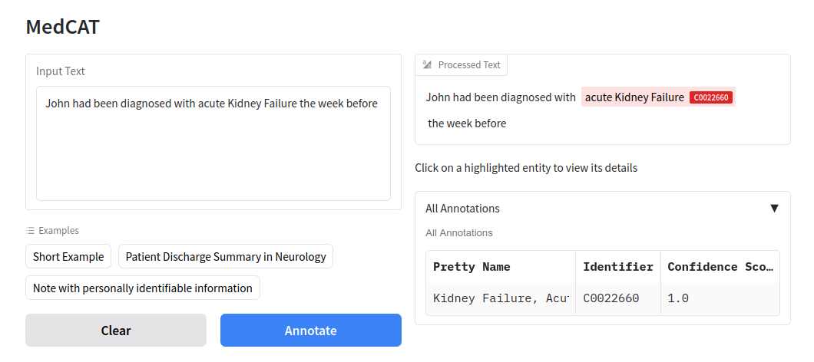
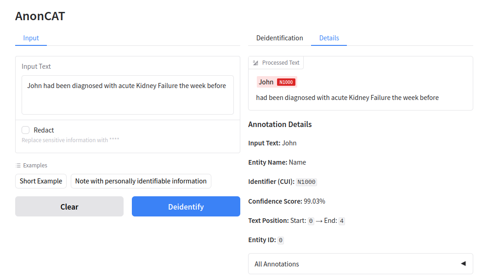

# Demo UI

MedCAT Service includes a browser-based demo UI built with [Gradio](https://www.gradio.app/). It lets you try the loaded model on sample or custom text without writing API clients.

## Enable the demo UI

!!! tip
    The demo UI is **disabled by default**. Set these environment variables before starting the service:

    | Variable | Description | Default |
    |----------|-------------|---------|
    | `APP_ENABLE_DEMO_UI` | Mount the Gradio UI on the FastAPI app | `False` |
    | `APP_DEMO_UI_PATH` | URL path for the UI (empty string mounts at `/`) | `/` |

    See [Configuration](../setup/configuration.md) for more details

The interface adapts to the model you load:

| Mode | When | What you see |
|------|------|----------------|
| **MedCAT** | Default (`DEID_MODE=False`) | Named entity recognition with highlighted concepts and entity details |
| **AnonCAT** | De-identification (`DEID_MODE=True`) | PHI detection, optional redaction, and a de-identified text output |

## MedCAT (named entity recognition)

When the service runs with a standard MedCAT model pack, the demo UI shows the **MedCAT** interface.

### Using the UI

1. Enter clinical text in **Input Text**, or pick an example from the dropdown (short note, discharge summary, or a note containing PII for comparison).
2. Click **Annotate** to run the loaded model.
3. Review results in the right-hand panel:
   - **Processed Text** — input with recognized spans highlighted in color.
   - **Annotation Details** — click a highlighted span to see the concept name, CUI, confidence, and character offsets.
   - **All Annotations** — expandable table of every entity returned by the model.

Click **Clear** to reset the input and results.

Recognized concepts depend entirely on the model pack you configured via `APP_MEDCAT_MODEL_PACK` or the individual CDB/vocabulary paths. Meta-annotation values from the model (for example negation or subject) are reflected in the underlying API responses; the demo table focuses on core entity fields.

## AnonCAT (de-identification)

When `DEID_MODE=True` (or `MEDCAT_DEID_MODE=True`) and an AnonCAT / de-ID model pack is loaded, the demo UI switches to the **AnonCAT** interface.

### Using the UI

1. Enter text in **Input Text**, or use an example (short note or a note with personally identifiable information).
2. Optionally enable **Redact** to replace detected PHI with `[***]` in the de-identified output. When unchecked, identifiable spans are still highlighted in **Details**, but the de-identified text keeps the original surface forms.
3. Click **Deidentify** to process the note.
4. Review results across tabs:
   - **Deidentification** — the processed note with redaction applied when **Redact** is enabled.
   - **Details** — same highlighted view and per-entity details as the MedCAT UI.

Default service redaction for API calls is controlled separately by `DEID_REDACT` (default `True`). The **Redact** checkbox only affects output from the demo UI for that run.

For programmatic access, see [API example use](api-example-use.md).
