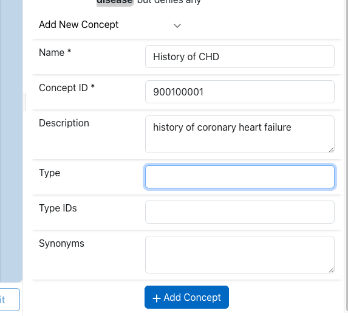
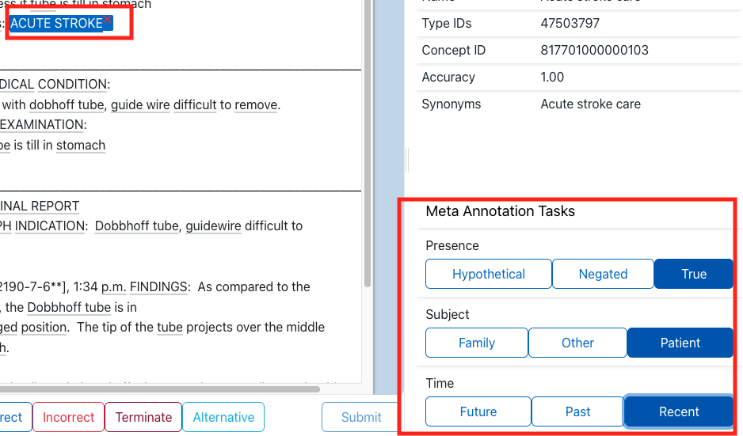
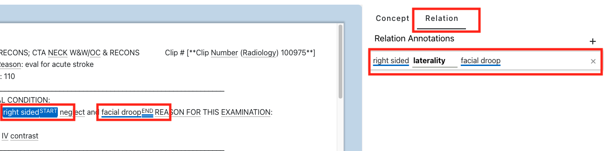

# Annotation Interface

The annotator view is designed for fast review and correction of model
predictions.

## 1) Document list

The left panel shows documents in the project dataset.

- Current document is highlighted.
- Prepared documents (model predictions generated) are marked.
- Submitted/validated documents are marked as complete.

## 2) Clinical text

The center panel displays document text with detected concept spans.

Select spans by clicking them directly, then apply one status from the task bar.

### Supported concept statuses

| Status        | Meaning                                                                                   |
|---------------|------------------------------------------------------------------------------------------|
| **Correct**   | The detected concept annotation is correct for this span of text.                         |
| **Incorrect** | The detected concept annotation is incorrect and should not be assigned to this span.     |
| **Terminate** | (If enabled) This sends a strong signal to the underlying model that no further suggestions wanted like this. |
| **Alternative** | The annotation is wrong, but a different concept should be assigned (choose another concept). |
| **Irrelevant** | (If enabled) The annotation is not relevant to the project or task context.             |

Only one status can be active per concept at a time.

### Adding missing annotations

If the model missed a mention:

| Step | Action | Screenshot |
|------|--------|------------|
| 1 | Highlight text in the document. |  |
| 2 | Right-click and choose **Add Term**. |  |
| 3 | Search/select a concept in the concept picker. |  |
| 4 | Confirm to create the annotation. |  |

### Adding New Concepts

Projects with `Add New Entities` enabled can also create brand-new concepts. This option should be used with caution as most concept databases will be complete for most use cases. Before creating new concepts agree with the project admin the set of concepts that should be created.

### Overlapping Annotations

This allows the data collection of entities that span the same portion of text across multiple entities.

## 3) Task bar and submission

The task bar contains status buttons and the **Submit** button.

- Submit is enabled only when required tasks are completed for all concepts.
- On submit, a confirmation dialog shows an annotation summary.
- If project `train_model_on_submit` is enabled, submitted annotations are used
  for incremental model updates (except remote model-service projects).

## 4) Header actions

Top-right actions:

- **Summary**: open document annotation summary.
- **Help**: keyboard shortcuts, project guidance.
- **Reset document**: re-prepare current document and clear document-level
  annotation state. This returns the document to its pre-annotated state.

## 5) Right sidebar (concept details)

The sidebar shows details for the currently selected concept, including:

- concept name/CUI
- type IDs/semantic type (if available)
- synonyms and description
- confidence score

If enabled by project settings, a **Comment** field is also available.

!!! tip
    If the details are not showing in the sidebar after you've selected one, the issue is likely with an unfinished Project setup. See the section for "Concept lookup index (Solr import)" in the [Project Creation and Management Guide](project_admin.md) for details.

## Meta annotations

Depending on project configuration:

Configured **Meta Annotation Tasks** appear for concepts that are marked as correct by an annotator

!!! tip
    Meta Annotation Tasks and the associated values for each task are imported automatically from MedCAT model packs once they are uploaded via `/project-admin/`.

### Annotating Meta Tasks

When a concept is selected and marked as **Correct** (or Alternative), the right sidebar will display **Meta Annotation Tasks** for that concept, if any are configured for the project. These are contextual classifications for the given concept.

- Each task (e.g., Temporality, Assertion, Experiencer) appears as a set of selectable options (radio buttons or toggle chips).
- Select the value(s) which best apply to the concept occurrence.
- **Meta tasks must be completed as required** before the document can be submitted.

Meta annotation fields may also show predicted values if your project uses a model pack with MetaCAT models. You can override or confirm these predictions before submission.

**Example:**

> For "sore throat":
> - Temporality: **Present (selected)**
> - Assertion: **Affirmed (selected)**
> - Experiencer: **Patient (selected)**

Missing or incomplete meta task selection will highlight the meta section and prevent submitting until all required fields are filled.

For more on configuring meta tasks, see [Meta Annotations](meta_annotations.md).

### Annotating Relations

Relation annotations allow you to specify the relationship(s) between two or more concepts in a document (for example, linking "right sided" as a laterality descriptor for a symptom e.g. "facial droop"). If your project is configured for relation annotation, the right sidebar will show available relation tasks when two or more relevant concepts are selected or highlighted in the document.

- Each relation task will appear as a labeled field with possible relation types (e.g., "is treatment for", "causes", "associated with").
- To annotate a relation, select the 'start' concept, then select the related 'end' concept. The relation options will become available between these concepts.
- Pick the correct relation type from the options, or select "None" if no relation applies.
- Some projects may allow multiple relations per concept pair.

**Example:**

> "right sided" ← **is a laterality descriptor for** → "facial droop"

Relation annotation fields may be required before submitting a document, depending on the project setup. Incomplete required relations will block submission and highlight the needed fields.

For guidance on configuring relations for your project, see [Meta Annotations](meta_annotations.md).

## Keyboard shortcuts

| Shortcut | Action |
|---|---|
| Up / Down | Previous / next document |
| Left / Right (or Space) | Previous / next concept |
| `1` | Correct |
| `2` | Incorrect |
| `3` | Terminate (if enabled) |
| `4` | Alternative |
| `5` | Irrelevant (if enabled) |
| Enter | Submit / confirm submit |
| Esc | Close active modal/cancel active add-term flow |
